# Active Directory Help Desk Lab

## Overview

This project is a hands-on IT Help Desk and Active Directory lab built using Microsoft Hyper-V.

The purpose of this lab was to simulate a small business Windows environment and practice common Tier 1 Help Desk / Service Desk responsibilities, including:

- Active Directory administration
- User account creation
- Password resets
- Account lockouts
- User onboarding and offboarding
- Security group management
- Windows domain joining
- Group Policy
- DNS troubleshooting
- Event Viewer
- PowerShell
- Technical documentation

---

# Lab Environment

## Virtualization

- Microsoft Hyper-V
- Internal Virtual Switch: `HelpDesk-Lab`

## Domain Controller

- Operating System: Windows Server 2025
- Hostname: `HD-DC01`
- IP Address: `10.10.10.10`
- Roles:
  - Active Directory Domain Services
  - DNS Server

## Client Workstation

- Operating System: Windows 11 Pro
- Hostname: `HD-CLIENT01`
- IP Address: `10.10.10.20`
- DNS Server: `10.10.10.10`

## Active Directory Domain

`helpdesklab.local`

---

# Lab Architecture

```text
Hyper-V Host
│
└── HelpDesk-Lab Internal Virtual Switch
    │
    ├── HD-DC01
    │   ├── Windows Server 2025
    │   ├── Active Directory Domain Services
    │   ├── DNS Server
    │   └── 10.10.10.10
    │
    └── HD-CLIENT01
        ├── Windows 11 Pro
        ├── Domain-Joined Workstation
        └── 10.10.10.20
```

---

# 1. Hyper-V Network Configuration

Created an internal Hyper-V virtual switch named:

`HelpDesk-Lab`

This provides an isolated network for the Domain Controller and Windows 11 client.

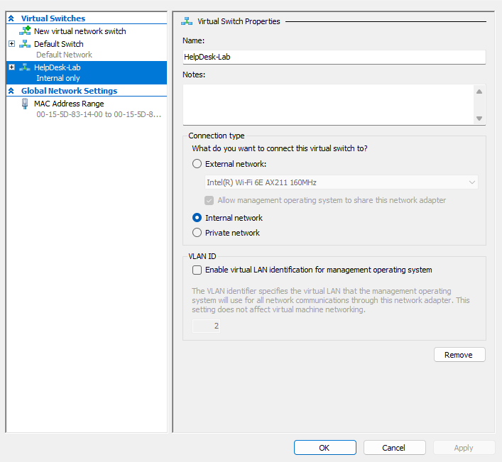

---

# 2. Domain Controller Virtual Machine

Created a Windows Server virtual machine named:

`HD-DC01`

The virtual machine was configured with:

- 2 virtual processors
- 4 GB RAM
- Generation 2
- Hyper-V internal network
- Windows Server 2025

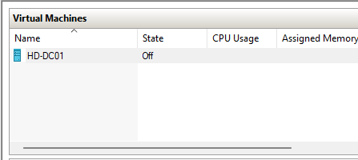

Windows Server 2025 was then installed successfully.

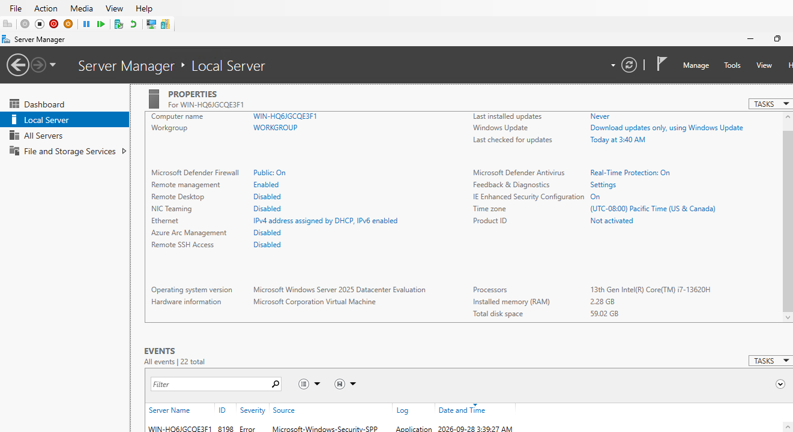

The server was renamed to:

`HD-DC01`

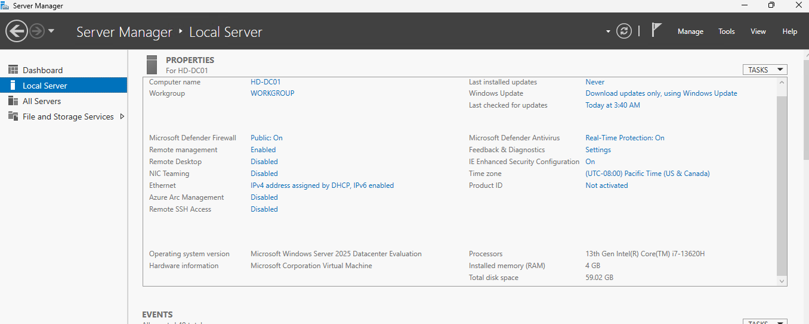

---

# 3. Static IP Configuration

Configured the Domain Controller with a static IPv4 address.

```text
IP Address: 10.10.10.10
Subnet Mask: 255.255.255.0
DNS Server: 10.10.10.10
```

Verified the configuration using:

```cmd
ipconfig /all
```

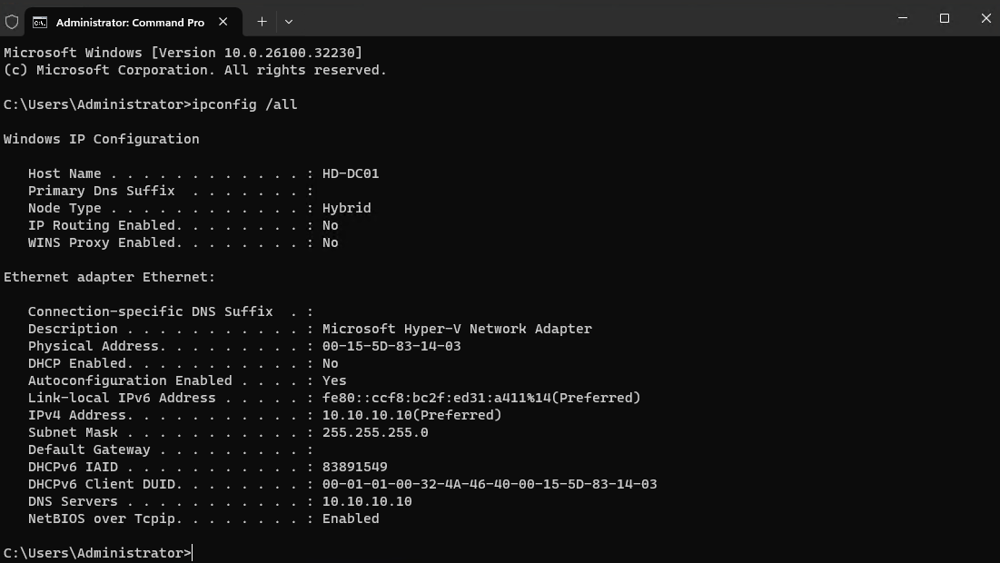

---

# 4. Active Directory Domain Services

Installed the Active Directory Domain Services role on Windows Server 2025.

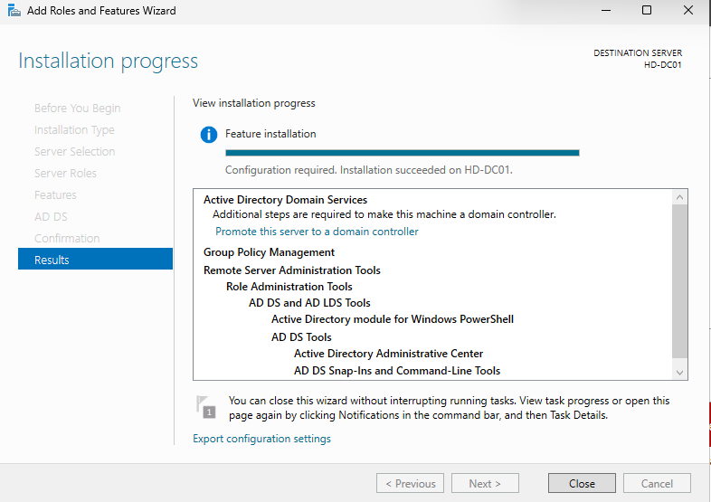

Promoted `HD-DC01` to a Domain Controller and created a new Active Directory forest.

Domain:

`helpdesklab.local`

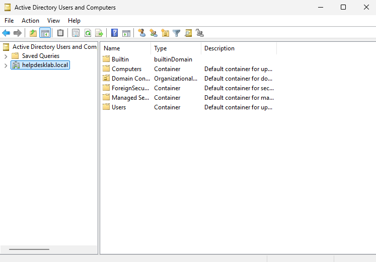

---

# 5. DNS Configuration

DNS was installed and configured alongside Active Directory Domain Services.

Verified the DNS zone:

`helpdesklab.local`

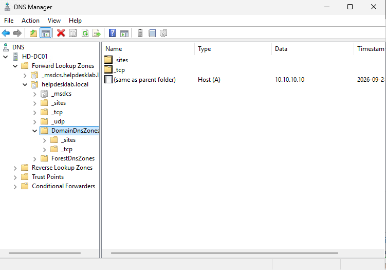

Tested domain resolution using:

```cmd
nslookup helpdesklab.local
```

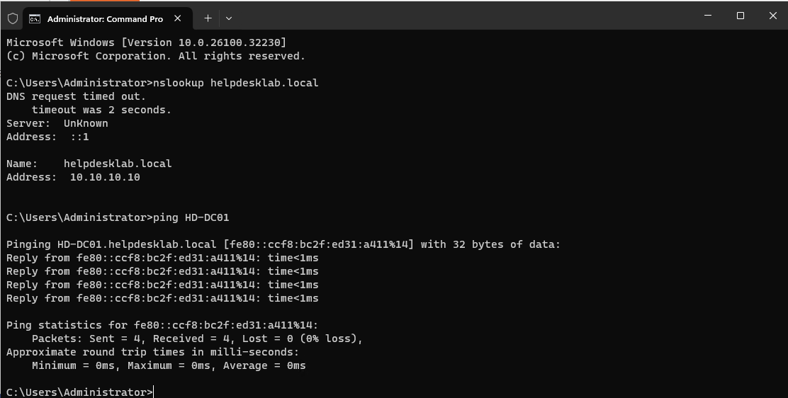

---

# 6. Organizational Unit Structure

Created a custom Organizational Unit structure to simulate departments within an organization.

```text
HelpDeskLab
├── Users
│   ├── HR
│   ├── Finance
│   ├── Sales
│   └── IT
├── Computers
├── Groups
└── Disabled Users
```

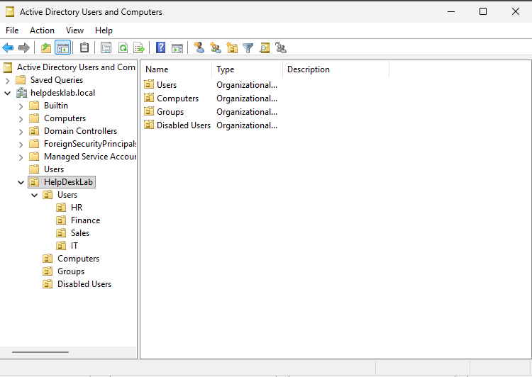

---

# 7. User Account Administration

Created multiple fictional test users across different departments.

Example users:

- Emma Carter — HR
- Olivia Taylor — HR
- Daniel Brown — Finance
- Sophia Lewis — Finance
- Sarah Wilson — Sales
- James Lee — Sales
- Michael Evans — IT
- Alex Morgan — IT

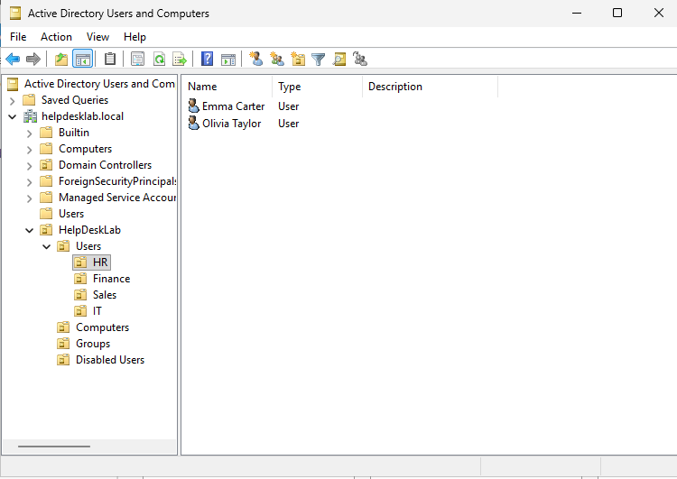

---

# 8. Security Groups

Created Global Security Groups for each department.

```text
GG-HR
GG-Finance
GG-Sales
GG-IT
```

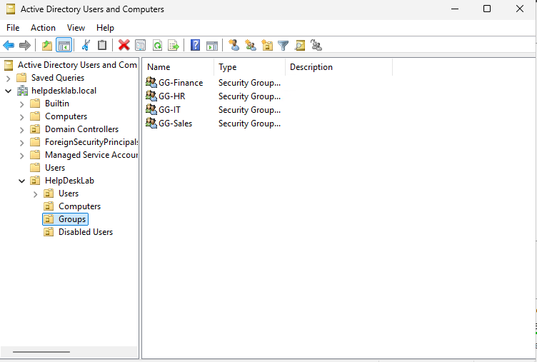

Users were added to the appropriate departmental security groups.

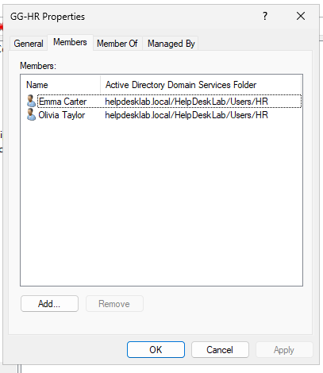

Verified individual user group membership.

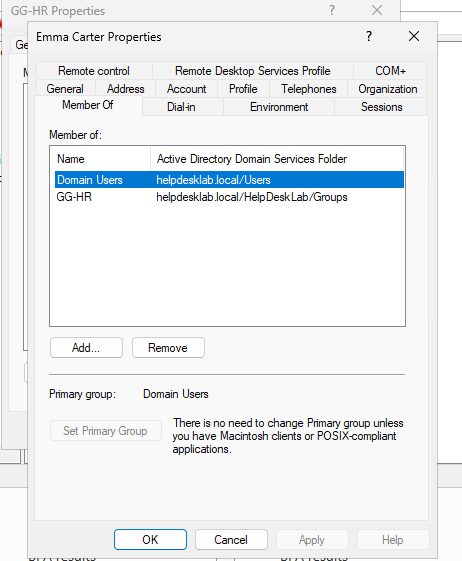

---

# 9. Windows 11 Client VM

Created a Windows 11 Pro virtual machine named:

`HD-CLIENT01`

Both server and client VMs were connected to the same Hyper-V internal switch.

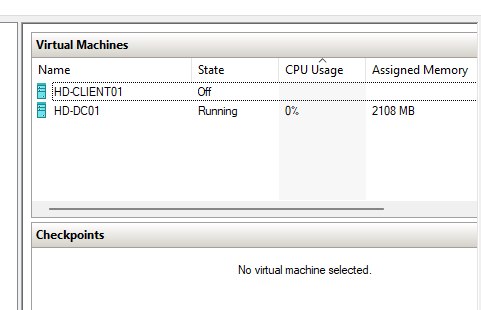

The Windows 11 workstation was renamed:

`HD-CLIENT01`

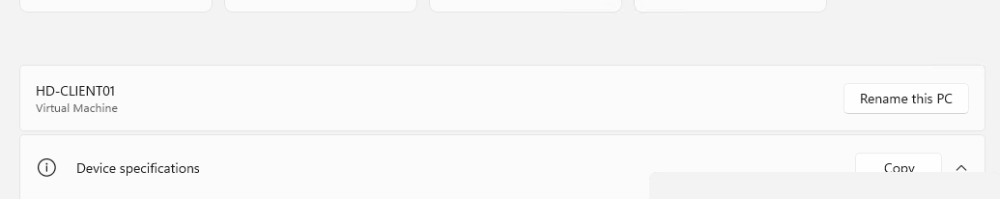

---

# 10. Windows 11 Network Configuration

Configured the Windows 11 client with:

```text
IP Address: 10.10.10.20
Subnet Mask: 255.255.255.0
DNS Server: 10.10.10.10
```

Verified using:

```cmd
ipconfig /all
```

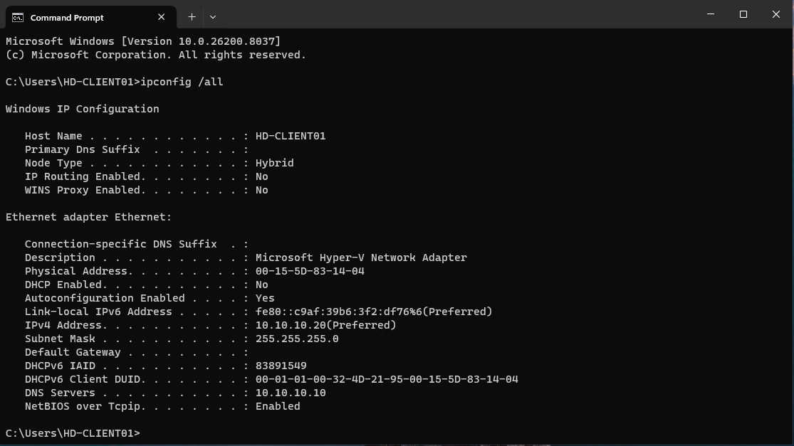

Tested connectivity to the Domain Controller using:

```cmd
ping 10.10.10.10
nslookup helpdesklab.local
```

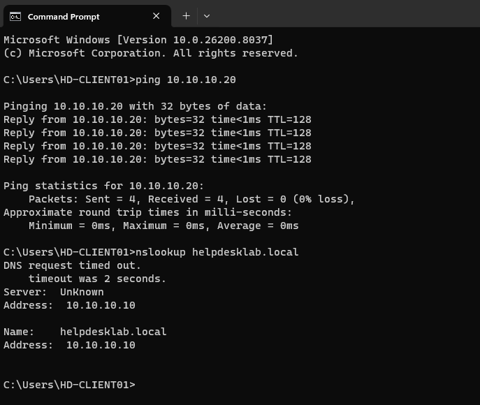

---

# 11. Domain Join

Joined the Windows 11 workstation to:

`helpdesklab.local`

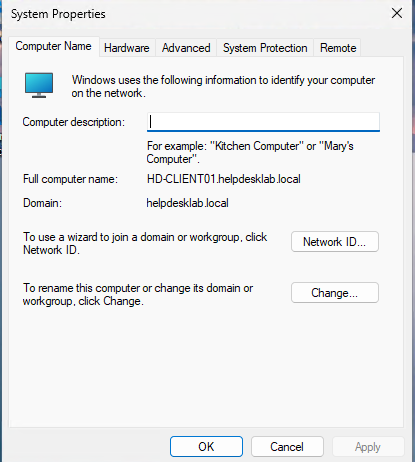

Logged in using an Active Directory domain account.

Verified using:

```cmd
whoami
```

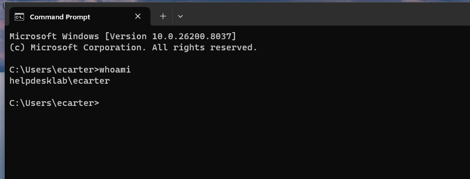

Moved the workstation computer object into the custom Computers OU.

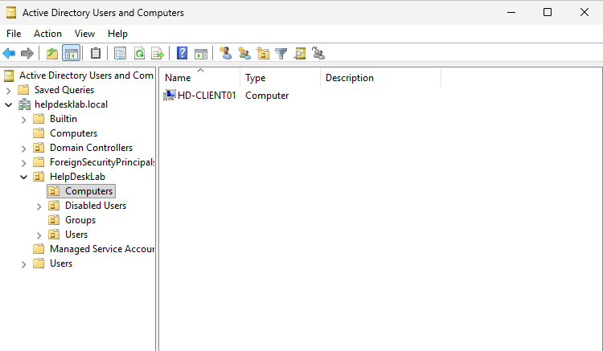

---

# 12. Help Desk Scenario — Password Reset

## Issue

A user forgot their password and could not log in.

## Diagnosis

Located the user account in Active Directory Users and Computers and confirmed that the account was active.

## Resolution

- Reset the user's password
- Enabled `User must change password at next logon`
- Verified successful authentication from the Windows 11 client

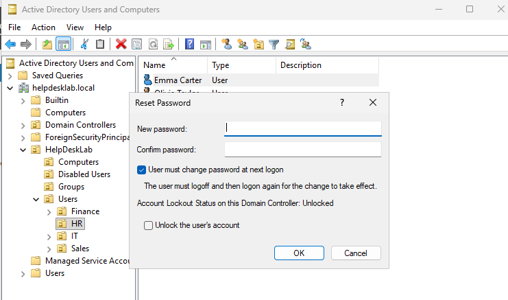

Verified successful login after the password change.

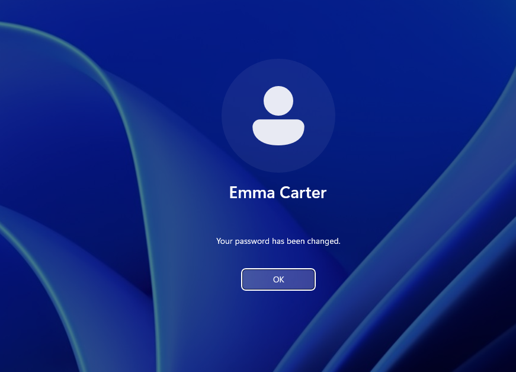

## Tools Used

- Active Directory Users and Computers
- Windows Server 2025
- Windows 11 Pro

---

# 13. Help Desk Scenario — User Offboarding

## Issue

A user account needed to be disabled as part of an employee offboarding process.

## Diagnosis

Located the user's account inside the correct departmental OU.

## Resolution

- Disabled the user account
- Moved the user to the `Disabled Users` OU

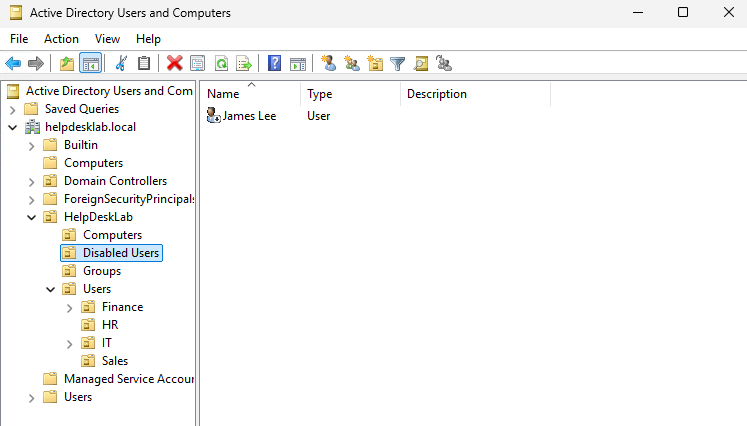

## Tools Used

- Active Directory Users and Computers
- Organizational Units

---

# 14. Help Desk Scenario — User Re-enabled

## Issue

A previously disabled employee account needed to be restored.

## Diagnosis

Located the disabled account inside the `Disabled Users` OU.

## Resolution

- Re-enabled the user account
- Moved the user back to the correct department OU
- Verified account status

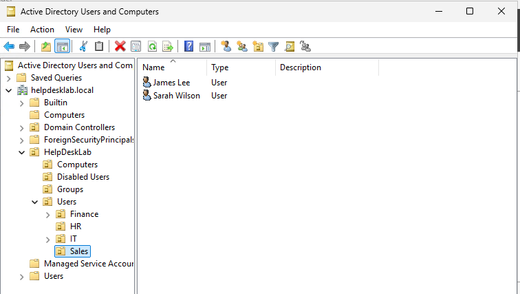

## Tools Used

- Active Directory Users and Computers

---

# 15. Help Desk Scenario — Security Group Membership Change

## Issue

A user changed departments and required different group access.

## Diagnosis

Reviewed the user's current Active Directory group memberships.

## Resolution

- Removed the user from the previous departmental security group
- Added the user to the new departmental security group
- Verified updated membership

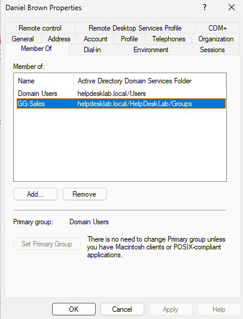

## Tools Used

- Active Directory Users and Computers
- Active Directory Security Groups

---

# 16. Group Policy

Created a Group Policy Object named:

`HelpDesk-User-Policy`

Linked the policy to the custom Users OU.

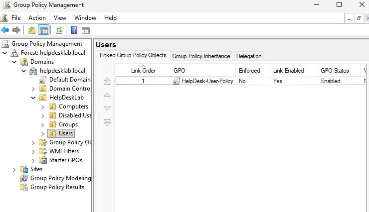

Configured:

`Prohibit access to Control Panel and PC settings`

Forced Group Policy refresh using:

```cmd
gpupdate /force
```

Verified applied policies using:

```cmd
gpresult /r
```

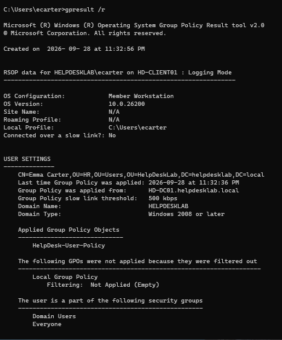

Verified the restriction on the Windows client.

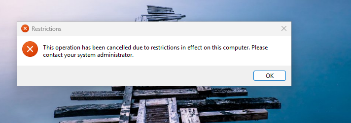

## Tools Used

- Group Policy Management
- `gpupdate`
- `gpresult`

---

# 17. Help Desk Scenario — Account Lockout

## Issue

A user became locked out after multiple failed login attempts.

## Configuration

Configured the following policy:

```text
Account Lockout Threshold: 3 failed attempts
Account Lockout Duration: 15 minutes
Reset Account Lockout Counter: 15 minutes
```

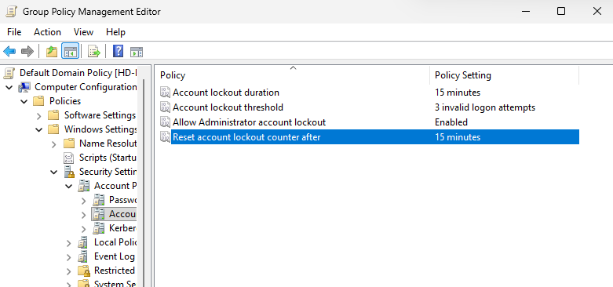

## Diagnosis

- Simulated repeated failed logins
- Checked the user account inside Active Directory Users and Computers
- Confirmed that the account was locked

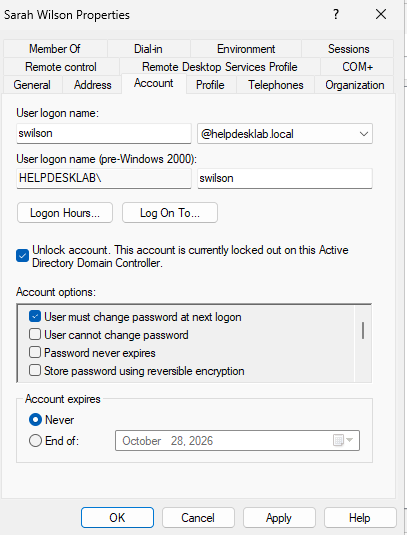

## Resolution

- Unlocked the user account
- Verified successful login with the correct password

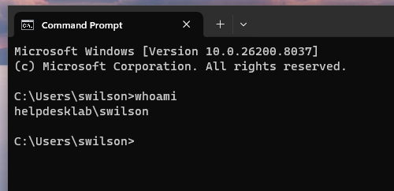

## Tools Used

- Active Directory Users and Computers
- Group Policy
- Windows 11 Pro

---

# 18. Help Desk Scenario — DNS Misconfiguration

## Issue

The Windows 11 workstation was intentionally configured with an incorrect DNS server:

`10.10.10.99`

This caused Active Directory domain-name resolution to fail.

## Diagnosis

Used:

```cmd
ipconfig /all
nslookup helpdesklab.local
```

The incorrect DNS server was identified.

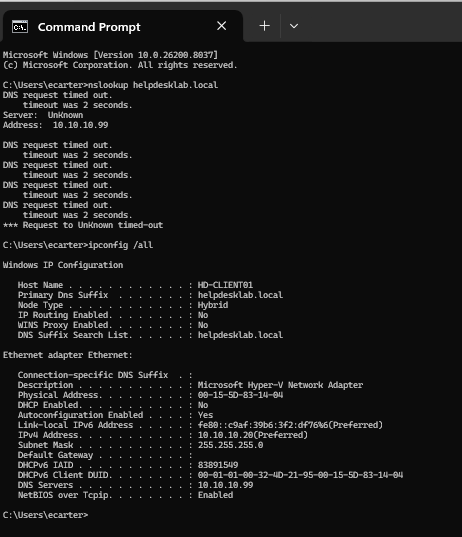

## Resolution

Changed the preferred DNS server back to the Domain Controller:

`10.10.10.10`

Cleared the DNS cache:

```cmd
ipconfig /flushdns
```

Verified successful resolution using:

```cmd
nslookup helpdesklab.local
ping HD-DC01
```

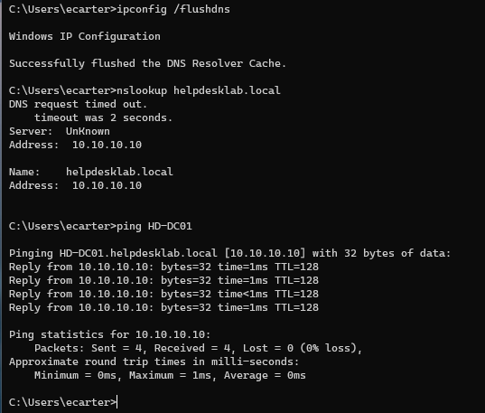

## Tools Used

- Windows Network Settings
- Command Prompt
- DNS
- `ipconfig`
- `nslookup`
- `ping`

---

# 19. Event Viewer Troubleshooting

Used Windows Event Viewer to inspect system and authentication-related logs.

Reviewed:

- Windows System logs
- Windows Security logs
- Authentication events
- Group Policy-related events

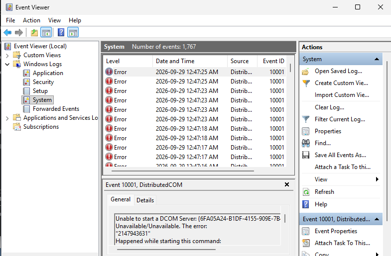

## Skills Practiced

- Log inspection
- Windows troubleshooting
- Authentication troubleshooting

---

# 20. PowerShell Active Directory Administration

Used PowerShell to query Active Directory users and groups.

Commands included:

```powershell
Get-ADUser -Filter *
```

```powershell
Get-ADGroup -Filter *
```

```powershell
Get-ADUser ecarter -Properties *
```

```powershell
Get-ADPrincipalGroupMembership ecarter
```

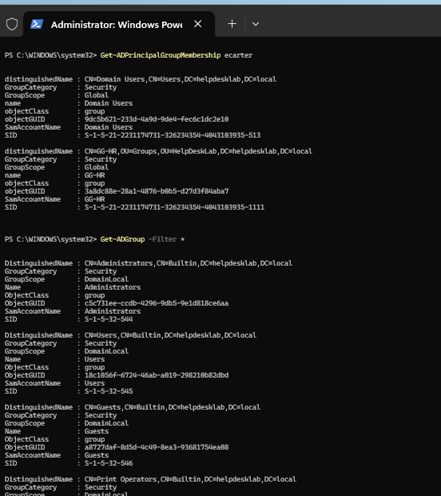

## Skills Practiced

- Active Directory PowerShell module
- User queries
- Group queries
- Group membership verification
- Command-line administration

---

# Commands Used

## Networking

```cmd
ipconfig /all
ping 10.10.10.10
ping HD-DC01
nslookup helpdesklab.local
ipconfig /flushdns
```

## Group Policy

```cmd
gpupdate /force
gpresult /r
```

## User Verification

```cmd
whoami
```

## Active Directory PowerShell

```powershell
Get-ADUser -Filter *
Get-ADGroup -Filter *
Get-ADUser ecarter -Properties *
Get-ADPrincipalGroupMembership ecarter
```

---

# Skills Demonstrated

This project demonstrates practical hands-on experience with:

- Active Directory
- Active Directory Domain Services
- Windows Server 2025
- Windows 11 Pro
- Microsoft Hyper-V
- Domain Controllers
- DNS
- TCP/IP
- Organizational Units
- Security Groups
- User account administration
- Password resets
- Account lockouts
- User onboarding
- User offboarding
- Account enabling and disabling
- Department transfers
- Access management
- Group Policy
- Windows domain joins
- DNS troubleshooting
- PowerShell
- Event Viewer
- Command Prompt
- Windows troubleshooting
- Help Desk support
- Technical documentation

---

# Help Desk Tasks Practiced

The lab included realistic Tier 1 support scenarios such as:

- Forgotten passwords
- Password resets
- Locked user accounts
- Account unlocking
- Employee offboarding
- Account reactivation
- Department transfers
- Group membership changes
- Domain authentication
- Group Policy troubleshooting
- DNS failures
- Network configuration issues
- Active Directory verification
- Windows Event Viewer troubleshooting

---

# Project Outcome

This project provided hands-on experience with common Tier 1 Help Desk and Service Desk responsibilities within a simulated Microsoft Windows enterprise environment.

The lab went beyond simply installing Active Directory and included realistic support scenarios involving:

- Authentication problems
- Forgotten passwords
- Locked accounts
- User access changes
- Employee onboarding and offboarding
- Security groups
- DNS failures
- Group Policy
- Windows workstation support
- PowerShell
- Troubleshooting
- Technical documentation

The project demonstrates practical skills relevant to roles such as:

- IT Help Desk Technician
- Service Desk Analyst
- IT Support Technician
- Desktop Support Technician
- Technical Support Specialist
- Tier 1 Support Analyst

---

# Repository Structure

```text
active-directory-helpdesk-lab
│
├── README.md
│
└── screenshots
    ├── 01-hyperv-internal-switch.png
    ├── 02-hd-dc01-vm-created.png
    ├── 03-windows-server-2025-installed.png
    ├── 04-server-renamed-hd-dc01.png
    ├── 05-static-ip-configuration.png
    ├── 06-active-directory-role-installed.png
    ├── 07-helpdesklab-domain-created.png
    ├── 08-dns-zone-helpdesklab.png
    ├── 09-domain-dns-test.png
    ├── 10-organizational-unit-structure.png
    ├── 11-department-users-created.png
    ├── 12-security-groups-created.png
    ├── 13-users-added-to-security-groups.png
    ├── 14-user-group-membership-verified.png
    ├── 15-hyperv-server-and-client-vms.png
    ├── 16-client-renamed-hd-client01.png
    ├── 17-client-static-ip-and-dns.png
    ├── 18-client-dc-connectivity-test.png
    ├── 19-client-joined-to-domain.png
    ├── 20-domain-user-login-verified.png
    ├── 21-client-computer-moved-to-custom-ou.png
    ├── 22-helpdesk-password-reset.png
    ├── 23-user-password-change-success.png
    ├── 24-disabled-user-account.png
    ├── 25-user-account-reenabled.png
    ├── 26-user-group-membership-changed.png
    ├── 27-group-policy-linked-to-users-ou.png
    ├── 28-group-policy-applied-client.png
    ├── 29-control-panel-restriction-verified.png
    ├── 30-account-lockout-policy-configured.png
    ├── 31-user-account-locked.png
    ├── 32-account-unlocked-login-verified.png
    ├── 33-dns-misconfiguration-failure.png
    ├── 34-dns-troubleshooting-resolved.png
    ├── 35-event-viewer-troubleshooting.png
    └── 36-powershell-active-directory-query.png
```

---

# Notes

- All user names shown in this project are fictional test accounts.
- All IP addresses shown are private lab addresses.
- No production systems or real company information were used.
- No passwords, product keys, API keys, or private credentials are included.
- The lab was created entirely for learning and portfolio purposes.
